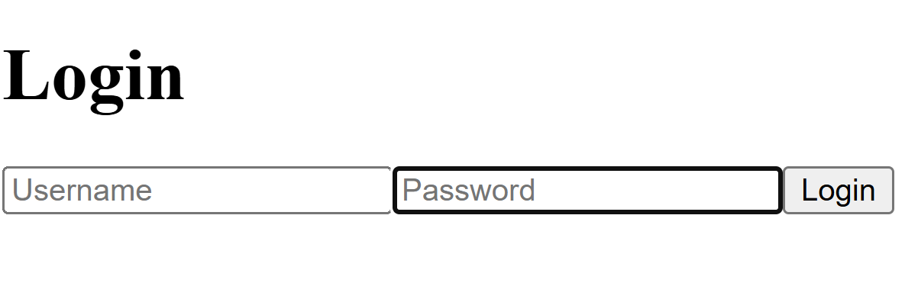

# Spring Security PostgreSQL Demo v2




A comprehensive full-stack authentication demo showcasing Spring Boot 3.x with Spring Security and PostgreSQL integration, paired with a modern Next.js frontend.

## 📖 Quick Setup Guide

**New to this project?** Follow our comprehensive [**SETUP_GUIDE.md**](./SETUP_GUIDE.md) for step-by-step instructions to get the application running.

## 🌟 Features

### Backend (Spring Boot)
- **Spring Security Integration**: Form-based authentication with session management
- **PostgreSQL Database**: User credentials stored securely with BCrypt password hashing
- **JPA/Hibernate**: Entity mapping and database operations
- **RESTful API**: Protected endpoints with role-based access control
- **CORS Configuration**: Properly configured for frontend integration

### Frontend (Next.js)
- **Modern React Framework**: Next.js 14 with App Router
- **TypeScript Support**: Type-safe development experience
- **Tailwind CSS**: Utility-first CSS framework for styling
- **Authentication Flow**: Login/logout with session-based authentication
- **Protected Routes**: Client-side route protection

### Security Features
- **BCrypt Password Hashing**: Secure password storage
- **Session-based Authentication**: Server-side session management
- **CSRF Protection**: Cross-site request forgery prevention
- **Role-based Authorization**: Admin and User role separation

## 🚀 Getting Started

### Prerequisites
- Java JDK 17+
- Maven 3.8+
- PostgreSQL 14+
- Node.js 18+
- npm or yarn

### Quick Setup
1. **Clone the repository**
   ```bash
   git clone https://github.com/raimonvibe/spring-security-postgres-demo-v2.git
   cd spring-security-postgres-demo-v2
   ```

2. **Follow the Complete Setup Guide**
   
   📋 **[Read SETUP_GUIDE.md](./SETUP_GUIDE.md)** for detailed step-by-step instructions including:
   - Prerequisites installation
   - Database setup and configuration
   - Backend and frontend startup
   - Testing and troubleshooting

3. **Quick Start Commands**
   ```bash
   # Setup database (PostgreSQL must be installed)
   sudo -u postgres psql -c "ALTER USER postgres PASSWORD '0000';"
   sudo -u postgres createdb auth_demo
   
   # Start backend (in one terminal)
   cd backend && mvn spring-boot:run
   
   # Start frontend (in another terminal)
   cd frontend && npm install && npm run dev
   ```

4. **Access the Application**
   - Frontend: http://localhost:3000
   - Backend API: http://localhost:8080
   - Login with: `admin/admin` or `user/user`

For detailed setup instructions and troubleshooting, refer to **[SETUP_GUIDE.md](./SETUP_GUIDE.md)**.

## 🏗️ Project Structure

```
spring-security-postgres-demo-v2/
├── backend/                 # Spring Boot application
│   ├── src/main/java/      # Java source code
│   │   └── com/example/demo/
│   │       ├── config/     # Security configuration
│   │       ├── controller/ # REST controllers
│   │       ├── entity/     # JPA entities
│   │       ├── repository/ # Data repositories
│   │       └── service/    # Business logic
│   ├── src/main/resources/ # Configuration files
│   │   ├── application.properties
│   │   └── data.sql       # Initial user data
│   └── pom.xml            # Maven dependencies
├── frontend/               # Next.js application
│   ├── src/app/           # React components
│   │   ├── login/         # Login page
│   │   ├── layout.js      # Root layout
│   │   └── page.js        # Home page
│   └── package.json       # npm dependencies
├── SETUP_GUIDE.md         # Comprehensive setup instructions
└── README.md              # This file
```

## 🔐 Default User Accounts

The application comes with pre-configured test users:

| Username | Password | Role  | Description |
|----------|----------|-------|-------------|
| admin    | admin    | ADMIN | Full access to all features |
| user     | user     | USER  | Standard user access |

## 🧪 Testing the Application

1. **Start both applications** (backend on :8080, frontend on :3000)
2. **Navigate to** http://localhost:3000
3. **Click "Go to Protected Page"** - you'll be redirected to login
4. **Login with test credentials** (admin/admin or user/user)
5. **Verify protected content** is accessible after authentication

## 🛠️ Technology Stack

### Backend
- **Spring Boot 3.3.3** - Application framework
- **Spring Security** - Authentication and authorization
- **Spring Data JPA** - Data persistence layer
- **PostgreSQL** - Database
- **Maven** - Build tool
- **Java 17+** - Programming language

### Frontend
- **Next.js 14** - React framework
- **TypeScript** - Type safety
- **Tailwind CSS** - Styling
- **Node.js 18+** - Runtime environment

## 📚 Learning Resources

This project demonstrates key concepts in:
- Spring Security configuration and customization
- JPA entity relationships and repository patterns
- Session-based authentication vs JWT
- CORS configuration for full-stack applications
- Next.js App Router and client-side authentication
- PostgreSQL database integration

## 🤝 Contributing

1. Fork the repository
2. Create a feature branch (`git checkout -b feature/amazing-feature`)
3. Commit your changes (`git commit -m 'Add some amazing feature'`)
4. Push to the branch (`git push origin feature/amazing-feature`)
5. Open a Pull Request

## 📄 License

This project is licensed under the MIT License - see the [LICENSE](LICENSE) file for details.

## 🙏 Acknowledgments

- Spring Security documentation and community
- Next.js team for excellent documentation
- PostgreSQL community for robust database solutions

---

**Need help?** Check out the [SETUP_GUIDE.md](./SETUP_GUIDE.md) for detailed instructions or open an issue if you encounter problems.
